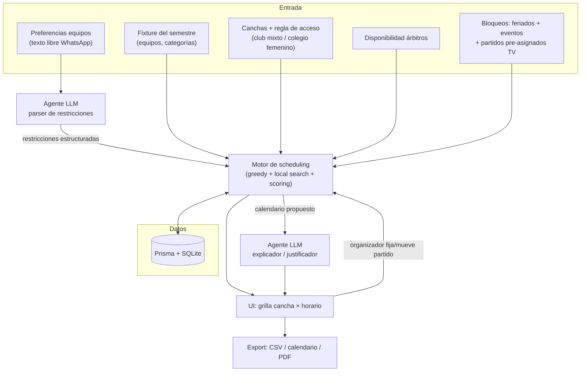

# Caso Práctico WhereX — Product Engineer
## Scheduler de torneos de hockey césped (FEHOCH)

> **Plan de trabajo — versión integrada con datos oficiales.**
> Entrega por correo a mbeltran@wherex.com: **martes 21 jul 2026, 09:00** (responder a todos).
> Presentación presencial: **jueves 23 jul 2026, 14:00** (30 min presentación + 15 min Q&A).
> Datos completos del torneo en `DATOS-TORNEO.md`; datos estructurados en `seed/torneo.seed.json`.

---

## 0. Estrategia de fondo (por qué este caso, así)

El caso evalúa **criterio, curiosidad y pensamiento de producto** — explícitamente *no* perfección técnica. La entrevistadora (Daisy Cruz) viene de delivery/gestión: valora ownership, comunicación negocio↔técnica y outcomes medibles por sobre profundidad algorítmica.

Tres apuestas deliberadas:

1. **Problema vivido de verdad.** Francisco juega hockey en Club Sport Francés. La historia es auténtica; el dominio se conoce desde adentro.
2. **El problema es un WhereX en miniatura.** Asignar un recurso escaso (canchas × horarios) a una demanda grande (partidos de muchas categorías) evaluando alternativas bajo restricciones reales, con múltiples actores de objetivos distintos. Es la misma familia de problema que resuelve WhereX (asignación/optimización bajo restricciones). Esto se dice explícito en la presentación.
3. **Arquitectura híbrida que demuestra control sobre el agente.** No "le pido a un LLM que arme el calendario". Separo un **solver determinístico** (restricciones duras, testeado) de un **agente LLM** (lenguaje natural + explicación). Esa separación *es* la señal de que controlo lo que hace el agente, no que confío ciegamente.

---

## 1. Definición del problema

**Hobby:** hockey césped. Contexto: **Torneo Nacional / Clausura 2026 de la FEHOCH** (Federación Chilena de Hockey sobre Césped).

**El problema:** un campeonato de hockey es **semestral** y hay que calendarizar todos los partidos de todas las categorías sobre un recurso escaso —las canchas— dentro de una ventana rígida: sábado y domingo, 08:00–19:00. Hoy lo arma una persona a mano, en planilla. La escala es grande (ver §2: solo Damas menores superan los 1.000 partidos por semestre). El problema real no es "encajar" los partidos —hay capacidad de sobra— sino encajarlos **bien**: sin choques de canchas ni de árbitros, en horarios razonables, con equidad entre equipos, respetando fechas imposibles, agrupando por club, y planificando el semestre **completo** por adelantado.

**Problemas reales que han ocurrido (motivan el diseño):**
- **Partidos en fechas imposibles:** se agendaron partidos en feriados importantes (ej. Día de la Madre) o a la hora de eventos masivos (final de Champions, final del Mundial) → poca gente llega.
- **Recuperaciones nocturnas malas:** cuando un equipo pide cambiar su horario, el partido termina recuperándose de noche un día de semana → mucha gente no puede por trabajo.
- **Semestre sin planificar con precisión:** las fechas lejanas quedan con **"hora a definir"**, lo que impide organizarse con anticipación.

**Por qué es relevante resolverlo:**
- Coordina a decenas de clubes, equipos y árbitros con objetivos en conflicto, a lo largo de un semestre entero.
- El proceso manual es lento, propenso a error y difícil de reoptimizar cuando algo cambia (lluvia, cambio de horario, equipo que se baja) — y ese reajuste manual es justo lo que genera las recuperaciones nocturnas.
- Un error de calendario tiene costo real: partidos que no se juegan, viajes en vano, ausencias, reclamos.

**Las 5 dimensiones que exige el caso, cubiertas:**

| Dimensión requerida | Cómo aparece |
|---|---|
| Información incompleta/fragmentada | Disponibilidad de árbitros y preferencias de equipos llegan por WhatsApp, en texto libre. |
| Múltiples personas con objetivos distintos | Equipos quieren buenos horarios; árbitros minimizar huecos; clubes agrupar a sus equipos; FEHOCH cumplir TV. |
| Evaluación de alternativas no trivial | Es scheduling/timetabling con restricciones — combinatorio, sin respuesta obvia. |
| Restricciones reales | Pocas canchas, ventana 8–19h, duración por categoría, 2 árbitros/partido, fechas bloqueadas, congelamiento a 15 días. |
| Deadlines específicos | El semestre completo debe quedar agendado por adelantado; nada de "hora a definir". |

---

## 2. Datos del dominio (reales, FEHOCH 2026)

Estos datos vienen del reglamento oficial y hacen el prototipo creíble. Detalle en `DATOS-TORNEO.md`.

### 2.1 Duración de partido — NO es uniforme

| Grupo de categorías | Formato | Juego + descanso | Bloque en el solver |
|---|---|---|---|
| Primera / Intermedia / Sub19 / Sub16 (Damas y Varones) | 4×15, descansos 2–10–2 | 74 min | **90 min** |
| Sub14 | 3×17, descansos de 5 | 61 min | **75 min** |
| Sub12 | 3×17, descansos de 4, **media cancha, 7 jugadoras** | 59 min | **70 min**, y **2 partidos en paralelo por cancha** |

Los empates se definen en shoot-out (5 penales adultos, 3 en Sub14, muerte súbita en Sub12), lo que alarga el fin del partido → el buffer entre partidos lo absorbe.

### 2.2 Canchas — modelo de acceso (corregido)

Todo club con equipo masculino tiene también equipo(s) femenino(s). Pero en los colegios chilenos **solo las mujeres juegan hockey**, así que hay más equipos y más canchas femeninas. Regla de acceso:

- **Canchas de club (uso mixto):** las usan hombres **y** mujeres.
- **Canchas de colegio (exclusivas femeninas):** solo mujeres.
- ⇒ **Mujeres acceden a TODAS las canchas. Hombres solo a las de club.**

Consecuencia clave para el solver: en una cancha de club, **los equipos masculino y femenino del mismo club compiten por el mismo horario** de fin de semana. Eso vuelve la agrupación por club y la coordinación intra-club (§5) aún más importantes. (Cantidades exactas de canchas por confirmar; supuesto de trabajo: ~7 de club + ~7 de colegio.)

### 2.3 Escala (fase regular = una rueda, n(n−1)/2 partidos)

- **Varones:** Primera A (8 equipos → 28 partidos), Primera B (9 → 36).
- **Damas Primera:** A, B, C (8 → 28 c/u), D (7 → 21); Intermedia A y B (8 → 28 c/u).
- **Damas menores:** Sub19A/Sub16A/Sub14A/Sub12AB (14 → 91 c/u), Sub16B (19 → 171), Sub14B (17 → 136), Sub12C (19 → 171), Sub14C (13 → 78), Sub12D1 (12 → 66), Sub12D2 (10 → 45).
- Solo Damas menores ya supera los **1.000 partidos por semestre**. A mano es inviable; ahí está el valor.

### 2.4 Concepto de "BLOQUE" de club

Los **mismos 14 clubes** presentan un equipo en cada categoría del bloque A (Sub12A, Sub14A, Sub16A, Sub19A): un club viaja como bloque. ⇒ conviene **agrupar todos los partidos de un club en el mismo recinto y día** (minimiza viajes y logística). El propio reglamento pide "coordinar partidos en paralelo del club".

### 2.5 Reglas operativas del reglamento → restricciones del sistema

- **Congelamiento a T-15 días:** los horarios se fijan 15 días antes; después solo cambian con acuerdo por mail de **ambos** clubes. → mecanismo concreto contra la recuperación nocturna improvisada.
- **Programación por TV/FEHOCH:** algunos partidos vienen con día/hora/cancha pre-asignados → input fijo para el solver.
- **Recuperación de pendientes:** antes de la última fecha de la fase regular, y en fin de semana (no en noche de semana).

---

## 3. Propuesta de solución

**Qué hace:** un asistente que recibe (a) los enfrentamientos del semestre por categoría, (b) las canchas y su regla de acceso por género, (c) disponibilidad de árbitros, (d) un calendario de bloqueos (feriados y eventos masivos), (e) partidos pre-asignados por TV, y (f) preferencias de equipos en texto libre; y produce el **calendario completo del semestre, factible y optimizado** (cancha × horario → partido), con la justificación de cada asignación y alertas de lo que no pudo satisfacer. Sin "hora a definir".

**Cómo mejora la experiencia:** de horas en planilla y conflictos post-publicación → a segundos, sin choques duros garantizados, con reoptimización instantánea cuando algo cambia. Humano en el loop: el organizador fija/mueve un partido y reoptimiza el resto.

**Qué decide el sistema/agente:**
- El **solver** decide la asignación partido→(cancha, horario, árbitros) respetando el 100% de las restricciones duras y maximizando un puntaje de restricciones blandas.
- El **agente LLM** decide cómo interpretar la disponibilidad en lenguaje natural ("el equipo X no puede el sábado AM") y la traduce a restricciones estructuradas; y explica el calendario ("¿por qué el equipo X quedó a las 8am?").

**Qué información utiliza:** fixture del semestre, catálogo de canchas + regla de acceso, disponibilidad de árbitros, calendario de bloqueos, partidos pre-asignados, preferencias de equipos, e histórico de "malos horarios" por equipo (equidad entre fechas).

**Cómo mediría el éxito:**
- **Factibilidad:** % de partidos con hora concreta (meta 100%, **cero "hora a definir"**).
- **Restricciones duras:** 0 violaciones (choques de cancha/árbitro, fechas bloqueadas, recuperación nocturna) — invariantes, se testean.
- **Preferencias:** % de partidos en horas "fáciles de recordar"; preferencias blandas cumplidas.
- **Equidad:** varianza de "slots indeseables" (08:00 / 18–19h) por equipo; balance sábado/domingo entre géneros.
- **Agrupación por club:** % de partidos de un club concentrados en un mismo recinto/día.
- **Tiempo de armado:** horas (manual) → segundos. El win más tangible.

**Qué entrega:**
- *Organizador (FEHOCH):* calendario publicable en segundos, justificado, exportable (grilla / CSV / calendario).
- *Clubes y equipos:* su horario claro y anticipado; canal para enviar preferencias antes.

---

## 4. Arquitectura simple

Diseño híbrido: el LLM hace lo que hace bien (lenguaje natural fragmentado, explicación); el solver hace lo que exige determinismo (restricciones duras).



**Componentes:**
1. **Modelo de datos (Prisma + SQLite):** Clubes, Categorías, Equipos, Canchas (+regla de acceso), Slots, Partidos, Árbitros, Restricciones, Bloqueos. SQLite = cero configuración.
2. **Motor de scheduling (módulo TS puro):** restricciones duras + blandas; greedy + búsqueda local con función de puntaje. Funciones puras, **testeadas con unit tests** (verificación + prueba de que controlo la correctitud).
3. **Capa de agente (Claude API):** parsea disponibilidad NL → restricciones; explica el calendario; sugiere qué relajar si es infactible. Mockeable para que el demo no dependa de red.
4. **API (Next.js route handlers):** `/parse`, `/schedule`, `/explain`.
5. **UI (React):** entrada de datos + grilla visual del fin de semana + panel "¿por qué?" + export.

**Flujo:** el organizador ingresa fixture + recursos + preferencias en texto libre → el agente normaliza las restricciones → el motor produce el calendario completo → la UI lo muestra como grilla → el organizador ajusta y reoptimiza → el agente explica.

**Decisión de diseño defendible (para Q&A):** *No uso el LLM para asignar partidos.* Un LLM no garantiza restricciones duras (podría poner dos partidos en la misma cancha a la misma hora). El solver garantiza factibilidad; el LLM se queda en la capa de lenguaje y explicación. Separar esas responsabilidades es controlar al agente.

### Deploy y despliegue (decisión tomada)

**Una sola app Next (front + API routes), un repo, un deploy, una URL, en Vercel.** Base de datos: **Postgres en Supabase**.

**Configuración crítica (Vercel serverless + Supabase):** cada invocación serverless abre su propia conexión a Postgres y agota el límite de conexiones. Se resuelve con el pooler de Supabase y dos URLs en Prisma:

```
DATABASE_URL  → connection string POOLED (Supavisor, puerto 6543, transaction mode)
DIRECT_URL    → connection string DIRECTA (puerto 5432, solo migraciones)
```

En `schema.prisma`: `url = env("DATABASE_URL")` + `directUrl = env("DIRECT_URL")`. Configurar desde el día 0 — descubrirlo tarde son horas de errores intermitentes.

**Nota de escala:** las funciones de Vercel cortan a los ~10s. El demo acotado a 1–3 categorías (~30–90 partidos) corre en milisegundos, así que no aplica. A escala semestral completa sí sería un problema — y esa es exactamente la respuesta de producción (job encolado, ver Q&A abajo).

**Por qué NO separar front y API en dos proveedores:** en 4 días el split cuesta dos pipelines, CORS, env vars duplicadas y sincronización — horas restadas al solver y la presentación, que sí se evalúan. Además el caso pide explícitamente *"no complejidad innecesaria, sino claridad de pensamiento"*. Construir el split no demuestra criterio; **explicar por qué no se construyó, sí**.

**La disciplina que sí importa:** el motor de scheduling es un **módulo TS puro, sin dependencia de framework**. No sabe si vive en Next o en Nest. Si esto se volviera producción, se levanta `engine/` a un servicio Nest sin tocarlo. El framework es un detalle de entrega; la lógica de dominio es portable.

**Respuestas guardadas para el Q&A:**
- *¿Por qué Next y no Nest?* Nest da DI/módulos/decoradores: arquitectura para un equipo y un código de larga vida. Para 3 endpoints y 4 días es overhead. La lógica de dominio está aislada igual.
- *¿Cómo lo llevas a producción?* El solver **no debería correr en un request HTTP** en ningún framework: sería un job encolado con polling o websocket, porque una optimización pesada no puede bloquear una request. Ahí sí separaría API y worker.
- *¿Y serverless / los cold starts?* El riesgo real no son los cold starts (~1s, irrelevante en un demo) sino el **límite de tiempo de ejecución** para trabajo CPU-bound, y que SQLite no persiste en filesystem efímero. Por eso: Postgres gestionado, y el demo acotado a una escala que corre en milisegundos. A escala completa, el solver sale del request y se vuelve un job — que es la respuesta de producción de arriba.

**Stack (elegido y por qué):**
- **TypeScript** — calza con Book2Dream y con WhereX; el type-safety en el modelo de restricciones evita bugs.
- **Next.js (App Router)** — API + UI en un proyecto; rápido de montar y demo visual.
- **Prisma + Postgres (Supabase)** — DX moderno (zanjada la duda TypeORM vs Prisma). **Postgres desde el día 0, no SQLite**, porque el prototipo se va a desplegar: SQLite no persiste en filesystems efímeros y no queremos drift entre dev y prod. Supabase por sobre Neon **por familiaridad** (Francisco ya lo usó): en un sprint de 4 días, familiaridad = reducción de riesgo.
  - **Alcance de Supabase: solo como Postgres, vía Prisma.** No usar `supabase-js`, Auth ni RLS — tener dos caminos de acceso a datos (Prisma en API routes + supabase-js en el front) enturbia justo lo que se evalúa. Un solo camino.
- **Motor propio, no librería de solver** — greedy + local search a mano es más explicable y controlable que una caja negra; poder explicarlo es una ventaja.
- **Claude API** para la capa de agente.

---

## 5. Modelo de restricciones (el corazón del solver)

**Restricciones DURAS — el solver las garantiza al 100% (se testean como invariantes):**
- Un partido ocupa 1 cancha × 1 bloque temporal; sin solapamiento en la misma cancha (salvo 2 partidos Sub12 en media cancha).
- Un equipo no juega dos partidos a la vez, y respeta el buffer entre sus propios partidos.
- 2 árbitros por partido; ningún árbitro en dos partidos simultáneos.
- **Acceso por género:** hombres solo en canchas de club; mujeres en canchas de club + de colegio.
- Ventana Sáb/Dom 08:00–19:00; bloque de duración según categoría (§2.1).
- **Fechas/horas bloqueadas:** nada en feriados grandes ni durante eventos masivos.
- **Partidos pre-asignados por TV/FEHOCH:** entran fijos, no reoptimizables.
- **Sin recuperaciones en noche de día de semana**; las recuperaciones van en fin de semana antes de la última fecha.
- **Horarios congelados a T-15 días:** después solo cambian con acuerdo de ambos clubes.
- Categorías **menores a Sub-12** (formativas): fuera del torneo semestral → campeonato mensual local. *(Sub-12 sí es parte del torneo.)*

**Restricciones BLANDAS — el solver las maximiza vía función de puntaje:**
- **Horas fáciles de recordar:** 13:00 / 13:30 (mejor) > 13:15 / 13:45 (borde) > otras.
- Categorías inferiores en primeras horas.
- **Equidad:** repartir los slots indeseables (08:00, 18–19h) entre equipos a lo largo del semestre.
- **Intercalar sábado/domingo entre géneros** (hoy femenino=sáb, masculino=dom, lo cual está mal); preferencia general por el sábado.
- **Agrupar por "bloque" de club:** juntar los partidos de un club en el mismo recinto y día (minimiza viajes; alivia la contención mixta en la cancha del club).
- Preferencias e indisponibilidades de cada equipo (del parser NL).
- Minimizar huecos muertos de cancha y de árbitros.

---

## 6. Roadmap de 4 días (vie 17 → entrega mar 21 09:00)

Días de trabajo: **vie 17, sáb 18, dom 19, lun 20.** Entrega martes AM. Presentación jueves.

**Día 0 — Vie 17 (hoy): esqueleto end-to-end.**
Scaffold Next.js + TS + Prisma + **Postgres (Supabase)**, con las dos URLs (pooled + direct) configuradas de entrada. Modelo de datos + carga del `seed/torneo.seed.json`. Slice mínimo: una categoría real (ej. Primera Varones A, 8 equipos) → generar fixture de una rueda → scheduler naíf → grilla en pantalla. Que algo se vea funcionando hoy. **Deploy temprano a Vercel** aunque sea el esqueleto: desplegar el día 0 evita sorpresas el día 4.

**Día 1 — Sáb 18: el motor de verdad.**
Restricciones duras (sin solapamiento cancha/equipo/árbitro, acceso por género, ventana, bloque por categoría, bloqueos) y blandas (puntaje). Greedy + búsqueda local. **Unit tests** de invariantes. Manejo de infactibilidad (qué no entró y por qué).

**Día 2 — Dom 19: agente + UI.**
Parser LLM (texto libre → restricciones) y explicador ("¿por qué el equipo X a las 8am?"). Wire a API + UI. Pulir grilla, panel "¿por qué?", export.

**Día 3 — Lun 20: pulido + presentación.**
Edge cases, README, commits limpios. Construir la **presentación (.pptx)**. Ensayar. Grabar GIF/video del demo como backup. Buffer.

**Mar 21 AM:** revisión final, enviar presentación a Melissa (responder a todos) **antes de las 09:00**.
**Mié 22 / Jue 23 AM:** ensayar, anticipar preguntas.

> Regla de scope: si el tiempo aprieta, se sacrifica el agente LLM (parser NL) antes que el solver + la grilla. El núcleo no-negociable es **solver testeado + demo visual + narrativa**. El agente es el diferenciador on-theme, pero degrada elegante a "pegar las preferencias en un formulario".

---

## 7. Presentación (30 min) — mapeada a los 5 elementos del caso

1. **El problema (~5 min).** Historia en primera persona: juego hockey, cada semestre este caos. Cierra con la conexión explícita a WhereX (asignar recursos escasos evaluando alternativas bajo restricciones).
2. **La solución (~6 min).** Qué hace, qué decide, qué mide (§3).
3. **Arquitectura (~5 min).** El diagrama. Énfasis en la decisión híbrida y **por qué NO dejo que el LLM asigne partidos** — aquí va la señal de control sobre el agente.
4. **Demo en vivo (~10 min).** Cargar categorías reales (con Sport Francés) → generar calendario → mostrar la grilla → cambiar una preferencia o bloquear una fecha → reoptimizar → preguntar "¿por qué?" y que el agente explique. (GIF de backup listo.)
5. **Cómo trabajé + métricas + próximos pasos (~4 min).** Workflow spec-first (este `PLAN.md` como evidencia), dónde dirigí al agente y dónde intervine (separé el solver porque el LLM fallaba en constraints duras). Trade-offs honestos y qué haría con más tiempo.

**Ángulo "cómo trabajo con agentes":** que emerja de la decisión de arquitectura, no como slide forzada. La prueba de control es el spec escrito, el solver determinístico testeado, y usar el LLM solo donde es confiable.

**Preguntas probables a preparar:** ¿cómo escala a >1.000 partidos? ¿qué pasa si es infactible? ¿por qué no OR-Tools? ¿cómo lo llevas a producción? ¿experiencia con IA/ML? (para esta última: honesto, pivotear a experiencia con datos —Pandas/Looker Studio— y hábito autodidacta).

---

## 8. Riesgos y mitigaciones

- **Sobre-ingeniería.** El caso premia claridad, no complejidad. Motor simple y explicable; no agregar features que no se demuestran.
- **Demo que falla en vivo.** GIF/video de backup grabado el lunes. Además: tener el proyecto corriendo **también en local** como respaldo de la URL desplegada.
- **Deploy dejado para el final.** Mitigación: desplegar el esqueleto el día 0, no el día 3.
- **Dependencia de red para el LLM.** Mockear respuestas del agente para el demo; API real como plus.
- **Escala en el demo.** Cargar 1–3 categorías reales para que sea legible en vivo; mencionar la escala total (>1.000) como argumento, sin renderizarla toda.
- **Tiempo.** El agente LLM es lo primero que se sacrifica; el núcleo es solver + grilla + narrativa.

---

## 9. Parámetros por confirmar con Francisco

- Cantidad exacta de canchas de club (mixtas) y de colegio (femeninas).
- Cuántos árbitros disponibles por fin de semana.
- ¿Cuántas categorías incluir en el demo? (recomendado: Primera Varones A + B y una Damas, por legibilidad).
